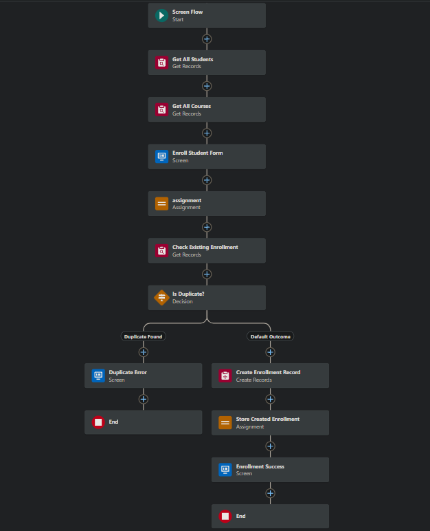
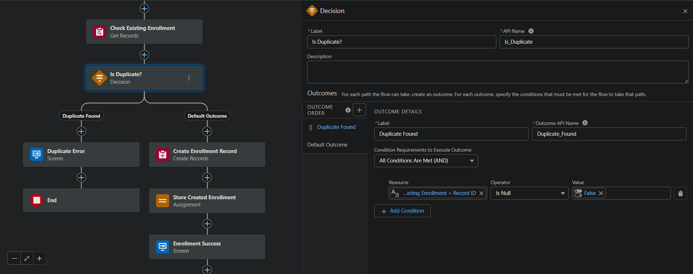
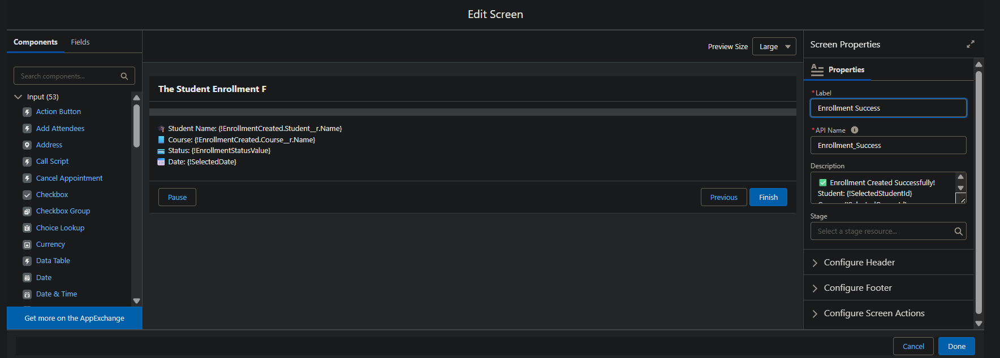

# Student-CRM-Salesforce-Project
A basic Salesforce CRM for managing student course enrollments.

## 🚀 Features

- 📘 Custom Objects: `Student__c`, `Course__c`, and `Enrollment__c` (junction object)
- 🔗 Relationships: Many-to-Many via Lookup fields
- 🎛️ Screen Flow: Guided student enrollment process with dropdowns
- 🚫 Duplicate Check: Prevents enrolling the same student in the same course twice
- ✅ Validation Rules: Ensures required data and correct logic
- 📊 Reports: Displays students enrolled per course
- ✨ Clean UI: Organized Lightning App, record pages, and related lists

## 🖼️ Flow Screenshots

> All screenshots are stored in the `/STUDENT_CRM/` folder.

### 🔹 Flow Overview

### 🔹 Duplicate Check Logic

### 🔹 Enrollment Form Screen

### 🔹 Error Screen for Duplicate

## 📄 Full Project Documentation

📥 [Download PDF Documentation](Student%20CRM.pdf)

